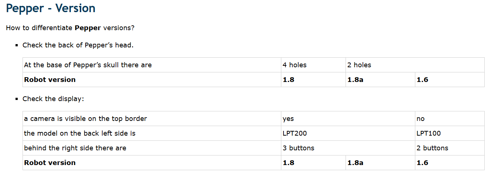
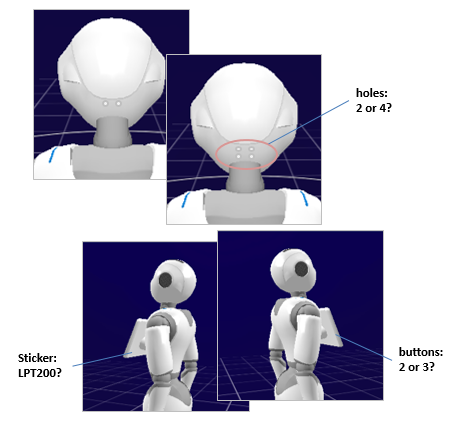

# Preparation

* Linux(Required) for using the library **qi**
* Recommand: **Ubuntu 20.04, Python 3.10+**
* Pepper's version: **Pepper 1.8** (4 holes at the base of Pepper's skull)
  * Check my robot's version

    
    
    
    (citation: http://doc.aldebaran.com/2-5/family/pepper_technical/pepper_versions.html)
    
* LLM：Llama3.2
* STT：OpenAI-Whisper
* TTS：qi.ALTextToSpeech()
* 运行后端：Ollama

Checked more in [http://doc.aldebaran.com/2-5/family/pepper_technical/pepper_versions.html](Pepper technical documentation)

`pip install -r requirements.txt`

## Download Ollama and Llama3 to run model locally

1. Make sure you open a terminal that **running ollama** at first.

`ollama run llama3:instruct`

2. Or you can use you own API in `llama_client.py`, recommand **Groq** platform/**GPT/Qwen** etc.

## Set Pepper's IP address

1. Once you get the Pepper's IP, set in `utils/connection.py` to test.
2. Edit the IP in `app.py` main().

## Other

* `utils.set_state.py` allow you to change Pepper's statement.
* `ssh nao@pepper's ip` can test in terminal through ssh remote connection and get into pepper's system.
* About our lab's pepper robot
  - username: nao
  - password: bigdata905
* More detail, please read Feishu doc: [feishu_link](https://ni7eviz47wi.feishu.cn/wiki/V2ykwkjj4iUNWRkzB0jcP4dBnpf "feishu_link")

# Run the project

Terminal run path: `pepper_chat/app.py`
Run command: `python app.py`
